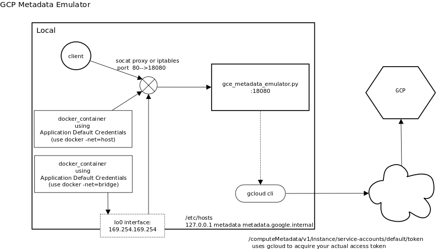
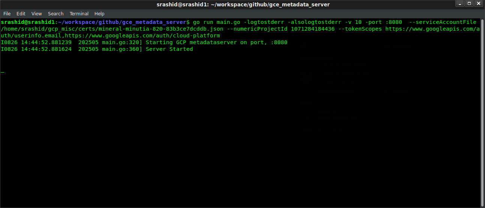

# GCE Metadata Server Emulator

This script acts as a GCE's internal metadata server.

It returns a live `access_token` that can be used directly by [Application Default Credentials](https://developers.google.com/identity/protocols/application-default-credentials) from any SDK library or return any GCE metadata key-value pairs and attributes.

For example, you can call `ADC` using default credentials or specifically with `ComputeCredentials` and also recall any GCE project or instance attribute.

```python
#!/usr/bin/python

from google.cloud import storage
import google.auth

import google.auth.compute_engine
import google.auth.transport.requests

from google.auth.compute_engine import _metadata

## with ADC metadata server
credentials, project = google.auth.default()    
client = storage.Client(credentials=credentials)
buckets = client.list_buckets()
for bkt in buckets:
  print(bkt)

## as compute credential
creds = google.auth.compute_engine.Credentials()
session = google.auth.transport.requests.AuthorizedSession(creds)
r = session.get('https://www.googleapis.com/userinfo/v2/me').json()
print(str(r))

## get arbitrary metadata values directly 
request = google.auth.transport.requests.Request()
print(_metadata.get_project_id(request))
print(_metadata.get(request,"instance/id"))
```

You can also run the metadata server directly in your app or in unit tests:

```golang
package main

import (
  	mds "github.com/salrashid123/gce_metadata_server"    
)

func TestSomething(t *testing.T) {

  // use any any credentials (static, real or fake)
  creds, _ := google.FindDefaultCredentials(ctx, "https://www.googleapis.com/auth/cloud-platform")

  serverConfig := &mds.ServerConfig{
		BindInterface: "127.0.0.1",
		Port:          ":8080",
  }

  claims := &mds.Claims{
		ComputeMetadata: mds.ComputeMetadata{
			V1: mds.V1{
				Project: mds.Project{
					ProjectID: "some_project_id",
				},
			},
		},
  }

  f, _ := mds.NewMetadataServer(ctx, serverConfig, creds, claims)

  err = f.Start()
  defer f.Shutdown()

  // optionally set a env var google sdk libraries understand
  // t.Setenv("GCE_METADATA_HOST", "127.0.0.1:8080")
  // do tests here, eg with "cloud.google.com/go/compute/metadata"
  // mid, _ := metadata.ProjectID()
}
```

The metadata server supports additional endpoints that simulate other instance attributes normally only visible inside a GCE instance like `instance_id`, `disks`, `network-interfaces` and so on.

For more information on the request-response characteristics:
* [GCE Metadata Server](https://cloud.google.com/compute/docs/storing-retrieving-metadata)
* [Predefined metadata keys](https://cloud.google.com/compute/docs/metadata/predefined-metadata-keys)
* [Set and remove custom metadata](https://cloud.google.com/compute/docs/metadata/setting-custom-metadata)

 The script performs the following:
 * returns the `access_token` and `id_token` provided by either
   * the serviceAccount JSON file you specify.
   * [workload identity federation](https://cloud.google.com/iam/docs/how-to#using-workload-identity-federation) configuration
   * service account impersonation
   * statically from a provided environment variable
   * service account RSA key on `HSM` or `Trusted Platform Module (TPM)`
 * return project attributes (`project_id`, `numeric-project-id`)
 * return instance attributes (`instance-id`, `tags`, `network-interfaces`, `disks`)

You can run the emulator:

1.  directly on your laptop
2.  within a docker container locally.
3.  as a kubernetes service
4.  with some difficulty, bound to the link-local address (`169.254.169.254`)
5.  within unit tests

The endpoints that are exposed are:

 ```golang
r.Handle("/computeMetadata/v1/project/project-id")
r.Handle("/computeMetadata/v1/project/numeric-project-id")
r.Handle("/computeMetadata/v1/project/attributes/{key}")

r.Handle("/computeMetadata/v1/instance/service-accounts/")
r.Handle("/computeMetadata/v1/instance/service-accounts/{acct}/")
r.Handle("/computeMetadata/v1/instance/service-accounts/{acct}/{key}")
r.Handle("/computeMetadata/v1/instance/network-interfaces/{index}/access-configs/{index2}/{key}")
r.Handle("/computeMetadata/v1/instance/attributes/{key}")
r.Handle("/computeMetadata/v1/instance/{key}")
r.Handle("/")
```

---

>> This is not an officially supported Google product

---

* [Configuration](#configuration)
  - [With JSON ServiceAccount file](#with-json-serviceaccount-file)
  - [With Impersonation](#with-impersonation)
  - [With Workload Federation](#with-workload-federation)
  - [With TPM](#with-trusted-platform-module-tpm)
* [Usage](#usage)      
* [Startup](#startup)
  - [AccessToken](#accesstoken)
  - [IDToken](#idtoken)
  - [Attributes](#attributes)
* [Using Google Auth clients](#using-google-auth-clients)
  - [python](#python)
  - [java](#java)
  - [golang](#golang)
  - [nodejs](#nodejs) 
  - [dotnet](#dotnet)  
  - [gcloud](#gcloud)        
* [Other Runtimes](#other-runtimes)
    - [Run with containers](#run-with-containers)
    - [Running as Kubernetes Service](#running-as-kubernetes-service)
    - [Static environment variables](#static-environment-variables)
- [Extending the sample](#extending-the-sample)
- [Using link-local address](#using-link-local-address)
- [Using domain sockets](#using-domain-sockets)
- [Running GCP ops-agent](#running-gcp-ops-agent)
- [Building with Bazel](#building-with-bazel)
- [Building with Kaniko](#building-with-kaniko)
* [Testing](#testing)

---

Note, the real metadata server has some additional query parameters which are either partially or not implemented:

- [recursive=true](https://cloud.google.com/compute/docs/metadata/querying-metadata#aggcontents) partially implemented
- [?alt=json](https://cloud.google.com/compute/docs/metadata/querying-metadata#format_query_output) not implemented
- [?wait_for_change=true](https://cloud.google.com/compute/docs/metadata/querying-metadata#waitforchange) not implemented

You are free to expand on the endpoints surfaced here..pls feel free to file a PR!

 

---

## Configuration 

The metadata server reads a configuration file for static values and uses a service account for dynamically getting `access_token` and `id_token`.

The basic config file format roughly maps the uri path of the actual metadata server and the emulator uses these values to populate responses.

For example, the `instance_id`, `project_id`, `serviceAccountEmail` and other files are read from the values here, for example, see [config.json](config.json):

```json
{
  "computeMetadata": {
    "v1": {
      "instance": {
        "id": 5775171277418378000,
        "serviceAccounts": {
          "default": {
            "aliases": [
              "default"
            ],
            "email": "metadata-sa@your-project.iam.gserviceaccount.com",
            "scopes": [
              "https://www.googleapis.com/auth/cloud-platform",
              "https://www.googleapis.com/auth/userinfo.email"
            ]
          }
        }
      },
      "oslogin": {},
      "project": {
        "numericProjectId": 708288290784,
        "projectId": "your-project"
      }
    }
  }
}
```

The field are basically a JSON representation of what the real metadata server returns recursively

```bash
$ curl -v -H 'Metadata-Flavor: Google' http://metadata/computeMetadata/v1/?recursive=true | jq '.'
```

Any requests for an `access_token` or an `id_token` are dynamically generated using the credential provided.  The scopes for any token uses the values set in the config file

## Usage

The following steps details how you can run the emulator on your laptop.

| Option | Description |
|:------------|-------------|
| **`-configFile`** | configuration File (default: `config.json`) |
| **`-interface`** | interface to bind to (default: `127.0.0.1`) |
| **`-port`** | port to listen on (default: `:8080`) |
| **`-serviceAccountFile`** | path to serviceAccount json Key file |
| **`-impersonate`** | use impersonation |
| **`-federate`** | use workload identity federation |
| **`-tpm`** | use TPM |
| **`-persistentHandle`** | TPM persistentHandle |
| **`-domainsocket`** | listen on unix socket |
| **`GOOGLE_PROJECT_ID`** | static environment variable for PROJECT_ID to return |
| **`GOOGLE_NUMERIC_PROJECT_ID`** | static environment variable for the numeric project id to return |
| **`GOOGLE_ACCESS_TOKEN`** | static environment variable for access_token to return |
| **`GOOGLE_ID_TOKEN`** | static environment variable for id_token to return |

### With JSON ServiceAccount file

Create a GCP Service Account JSON file (you should strongly prefer using impersonation..)

```bash
export PROJECT_ID=`gcloud config get-value core/project`
gcloud iam service-accounts create metadata-sa
```

You can either create a key that represents this service account and download it locally

```bash
gcloud iam service-accounts keys create metadata-sa.json \
   --iam-account=metadata-sa@$PROJECT_ID.iam.gserviceaccount.com
```

or preferably assign your user impersonation capabilities on it (see section below)

You can assign IAM permissions now to the service account for whatever resources it may need to access and then run:

```bash
mkdir certs/
mv metadata-sa.json certs

go run cmd/main.go -logtostderr --configFile=config.json \
  -alsologtostderr -v 5 \
  -port :8080 \
  --serviceAccountFile certs/metadata-sa.json 
```

### With Impersonation

If you use impersonation, the `serviceAccountEmail` and `scopes` are taken from the config file's default service account.

First setup impersonation for your user account:

```bash
gcloud iam service-accounts \
  add-iam-policy-binding metadata-sa@$PROJECT_ID.iam.gserviceaccount.com \
  --member=user:`gcloud config get-value core/account` \
  --role=roles/iam.serviceAccountTokenCreator
```

then,

```bash
go run cmd/main.go -logtostderr \
     -alsologtostderr -v 5  -port :8080 \
     --impersonate --configFile=config.json
```

### With Workload Federation

For [workload identity federation](https://cloud.google.com/iam/docs/how-to#using-workload-identity-federation), you need to reference the credentials.json file as usual:

then just use the default env-var and run:

```bash
export GOOGLE_APPLICATION_CREDENTIALS=`pwd`/sts-creds.json
go run cmd/main.go -logtostderr --configFile=config.json \
  -alsologtostderr -v 5 \
  -port :8080 --federate 
```

To use this mode, you must first setup the Federation and then set the environment variable pointing to the [ADC file](https://cloud.google.com/iam/docs/configuring-workload-identity-federation#aws).

for reference, see

* [Exchange Generic OIDC Credentials for GCP Credentials using GCP STS Service](https://github.com/salrashid123/gcpcompat-oidc)
* [Exchange AWS Credentials for GCP Credentials using GCP STS Service](https://github.com/salrashid123/gcpcompat-aws)

where the `sts-creds.json` file is the generated one you created.  For example using the OIDC tutorial above, it may look like

for example, if the workload federation user is mapped to

```
principal://iam.googleapis.com/projects/1071284184436/locations/global/workloadIdentityPools/oidc-pool-1/subject/alice@domain.com
```

then that identity should have the binding to use the metadata service account:

```bash
# enable federation for principal://
gcloud iam service-accounts add-iam-policy-binding metadata-sa@$PROJECT_ID.iam.gserviceaccount.com \
    --role roles/iam.workloadIdentityUser \
    --member "principal://iam.googleapis.com/projects/$GOOGLE_NUMERIC_PROJECT_ID/locations/global/workloadIdentityPools/oidc-pool-1/subject/alice@domain.com"
```

ultimately, the `sts-creds.json` will look like (note:, the `service_account_impersonation_url` value is not present)

```json
{
  "type": "external_account",
  "audience": "//iam.googleapis.com/projects/1071284184436/locations/global/workloadIdentityPools/oidc-pool-1/providers/oidc-provider-1",
  "subject_token_type": "urn:ietf:params:oauth:token-type:jwt",
  "token_url": "https://sts.googleapis.com/v1/token",
  "credential_source": {
    "file": "/tmp/oidccred.txt"
  }
}
```

where `/tmp/oidcred.txt` contains the original oidc token

### With Trusted Platform Module (TPM)

If the service account private key is bound inside a `Trusted Platform Module (TPM)`, the metadata server can use that key to issue an `access_token` or an `id_token`

>> Note: not all platforms supports this mode.  The underlying go-tpm library is only supported on a few of the targets (`linux/darwin + amd64,arm64`).  If you need support for other platforms, one option is to comment the sections for the TPM, remove the library bindings and compile.

Before using this mode, the key _must be_ sealed into the TPM and surfaced as a `persistentHandle`.  This can be done in a number of ways described [here](https://github.com/salrashid123/oauth2/blob/master/README.md#usage-tpmtokensource): 

Basically, you can either

- `A` download a Google ServiceAccount's json file and embed the private part to the TPM. [example](https://github.com/salrashid123/oauth2/blob/master/README.md#a-import-service-account-json-to-tpm)
- `B` Generate a Key _on the TPM_ and then import the public part to GCP. [example](https://github.com/salrashid123/oauth2/blob/master/README.md#b-generate-key-on-tpm-and-export-public-x509-certificate-to-gcp)
- `C` remote seal the service accounts RSA Private key, encrypt it with TPM's Endorsement Key and load it securely inside the TPM. [example](https://gist.github.com/salrashid123/9e4a0328fd8c84374ace78c76a1e34cb)

`B` is the most secure but `C` allows for multiple TPMs to use the same key 

Anyway, once the RSA key is present as a handle, start the metadata server using the `--tpm` flag and set the `--persistentHandle=` value.

TPM based tokens derives the serivceAccount email from the configuration file.   You must first edit `config.json` and set the value of `Claims.ComputeMetadata.V1.Instance.ServiceAccounts["default"].Email`.

After that, run

```bash
go run cmd/main.go -logtostderr --configFile=config.json \
  -alsologtostderr -v 5 \
  -port :8080 \
  --tpm --persistentHandle=0x81008000 
```

we're using a `persistentHandle` to save/load the key but a TODO is to load from the [context tree from files](https://github.com/salrashid123/tpm2/tree/master/context_chain)

The TPM based credentials imports a JWT generator library to perform the oauth and id_token exchanges: 

* [salrashid123/golang-jwt-tpm](https://github.com/salrashid123/golang-jwt-tpm)

A TODO enhancement could be to add on support for `PKCS-11` systems:  eg [salrashid123/golang-jwt-pkcs11](https://github.com/salrashid123/golang-jwt-pkcs11)

also see:

* [TPM Credential Source for Google Cloud SDK](https://github.com/salrashid123/gcp-adc-tpm)
* [PKCS-11 Credential Source for Google Cloud SDK](https://github.com/salrashid123/gcp-adc-pkcs)

## Startup

Use any of the credential initializations described above and on startup, you will see something like:

```bash
go run cmd/main.go -logtostderr --configFile=config.json \
  -alsologtostderr -v 5 \
  -port :8080 \
  --serviceAccountFile certs/metadata-sa.json 
```



### AccessToken

In a new window, run

```bash
curl -s -H 'Metadata-Flavor: Google' --connect-to metadata.google.internal:80:127.0.0.1:8080 \
   http://metadata.google.internal/computeMetadata/v1/instance/service-accounts/default/token

{
  "access_token": "ya29.c.EltxByD8vfv2ACageADlorFHWd2ZUIgGdU-redacted",
  "expires_in": 3600,
  "token_type": "Bearer"
}
```

Please note the scopes used for this token is read in from the declared values in the config file

### IDToken

The following endpoints shows how to acquire an IDToken

```bash
curl -H "Metadata-Flavor: Google" --connect-to metadata.google.internal:80:127.0.0.1:8080 \
'http://metadata.google.internal/computeMetadata/v1/instance/service-accounts/default/identity?audience=https://foo.bar'
```

The `id_token` will be signed by google but issued by the service account you used

```json
{
  "alg": "RS256",
  "kid": "178ab1dc5913d929d37c23dcaa961872f8d70b68",
  "typ": "JWT"
}.
{
  "aud": "https://foo.bar",
  "azp": "metadata-sa@$PROJECT.iam.gserviceaccount.com",
  "email": "metadata-sa@PROJECT.iam.gserviceaccount.com",
  "email_verified": true,
  "exp": 1603550806,
  "iat": 1603547206,
  "iss": "https://accounts.google.com",
  "sub": "117605711420724299222"
}
```

*Important:* To get `id_tokens`, you must edit `config.json` and set the value of

- `Claims.ComputeMetadata.V1.Instance.ServiceAccounts["default"].Email`

to the value present for the credentials you are using (eg set it to `metadata-sa@$PROJECT.iam.gserviceaccount.com` (substituting in value for your real $PROJECT))

>>> Unlike the _real_ gce metadataserver, this will **NOT** return the full identity document or license info :(`&format=[FORMAT]&licenses=[LICENSES]`)


### Attributes

To acquire instance or project attributes, simply call the endpoint:

For example, to get the instance id:

```bash
curl -s -H 'Metadata-Flavor: Google' --connect-to metadata.google.internal:80:127.0.0.1:8080 \
      http://metadata.google.internal/computeMetadata/v1/instance/id

5775171277418378000
```

## Using Google Auth clients

GCP Auth libraries support overriding the host/port for the metadata server.  


Each language library has their own nuances so please read the sections elow


These are not documented but you can _generally_ just set the value of.

If you intend to use the samples in the `examples/` folder, add some viewer permission to list gcs buckets (because this is what all the stuff in the `examples/` folder shows)

```bash
# note roles/storage.admin is over-permissioned...we only need storage.buckets.list on the project...
gcloud projects add-iam-policy-binding $PROJECT_ID  \
     --member="serviceAccount:metadata-sa@$PROJECT_ID.iam.gserviceaccount.com"  \
     --role=roles/storage.admin
```

then usually just,

```bash
export GCE_METADATA_HOST=localhost:8080
```

and use this emulator.  The `examples/` folder shows several clients taken from [gcpsamples](https://github.com/salrashid123/gcpsamples/tree/master/auth/compute).

Remember to run `gcloud auth application-default revoke` in any new client library test to make sure your residual creds are not used.

##### [python](https://github.com/googleapis/google-auth-library-python/blob/main/google/auth/compute_engine/_metadata.py#L35-L50)


```bash
  export GCE_METADATA_HOST=localhost:8080
  export GCE_METADATA_IP=127.0.0.1:8080

  virtualenv env
  source env/bin/activate
  pip3 install -r requirements.txt

  python3 main.py
```


##### [java](https://github.com/googleapis/google-auth-library-java/blob/main/oauth2_http/java/com/google/auth/oauth2/DefaultCredentialsProvider.java#L71)

```bash
   export GCE_METADATA_HOST=localhost:8080

   mvn clean install exec:java  -q
```

##### [golang](https://github.com/googleapis/google-cloud-go/blob/main/compute/metadata/metadata.go#L41-L46)
   
```bash
  export GCE_METADATA_HOST=localhost:8080

  go run main.go
```

##### [nodejs](https://github.com/googleapis/gcp-metadata/blob/main/src/index.ts#L36-L37)


```bash
  export GCE_METADATA_HOST=localhost:8080

  npm i
  node app.js  
```

##### [dotnet](https://github.com/googleapis/google-api-dotnet-client/blob/main/Src/Support/Google.Apis.Auth/OAuth2/GoogleAuthConsts.cs#L136)

```bash
  export GCE_METADATA_HOST=localhost:8080

  dotnet restore
  dotnet run
```

Note, `Google.Api.Gax.Platform.Instance().ProjectId` requests the full [recursive path](https://github.com/googleapis/gax-dotnet/blob/main/Google.Api.Gax/Platform.cs#LL61C69-L61C103)


#### gcloud

```bash
export GCE_METADATA_ROOT=localhost:8080

$ gcloud config list
[component_manager]
disable_update_check = True
[core]
account = metadata-sa@mineral-minutia-820.iam.gserviceaccount.com
project = mineral-minutia-820
```

`gcloud` uses a different env-var but if you want to use `gcloud auth application-default print-access-token`, you need to _also_ use `GCE_METADATA_HOST` and `GCE_METADATA_IP`


## Other Runtimes

### Run with containers

To access the local emulator _from_ containers

```bash
cd examples/container
docker build -t myapp .
docker run -t --net=host -e GCE_METADATA_HOST=localhost:8080  myapp
```

you can run the server itself directly 

```bash
docker run \
  -v `pwd`/certs/:/certs/ \
  -v `pwd`/config.json:/config.json \
  -p 8080:8080 \
  -t salrashid123/gcemetadataserver  \
      -serviceAccountFile /certs/metadata-sa.json \
      --configFile=/config.json \
      -logtostderr -alsologtostderr -v 5 \
      -interface 0.0.0.0 -port :8080
```

### Running as Kubernetes Service

You can run the emulator as a kubernetes `Service`  and reference it from other pods address by injecting `GCE_METADATA_HOST` environment variable to the containers:

If you want test this with `minikube` locally,

```bash
## first create the base64encoded form of the service account key
cat certs/metadata-sa.json | base64  --wrap=0 -
cd examples/kubernetes
```

then edit metadata.yaml and replace the values: 

```yaml
apiVersion: v1
kind: Secret
metadata:
  name: gcp-svc-account
type: Opaque
data:
  metadata-sa.json: "replace with contents of cat certs/metadata-sa.json | base64  --wrap=0 -"
---
apiVersion: v1
kind: ConfigMap
metadata:
  name: mds-config
data:
  config.json: |
     "replace with contents of config.json"  
```

Finally test

```bash
minikube start
kubectl apply -f .
minikube dashboard --url
minikube service app-service --url

$ curl -s `minikube service app-service --url`

Number of Buckets: 62
```

>> needless to say, the metadata Service should be accessed only form authorized pods

### Static environment variables

If you do not have access to certificate file or would like to specify **static** token values via env-var, the metadata server supports the following environment variables as substitutions.  Once you set these environment variables, the service will not look for anything using the service Account JSON file (even if specified)

```bash
export GOOGLE_PROJECT_ID=`gcloud config get-value core/project`
export GOOGLE_NUMERIC_PROJECT_ID=`gcloud projects describe $GOOGLE_PROJECT_ID --format="value(projectNumber)"`
export GOOGLE_ACCESS_TOKEN="some_static_token"
export GOOGLE_ID_TOKEN="some_id_token"
```

for example you can use those env vars and specify a fake svc account json key file (fake since its not actually even used)

```bash
go run cmd/main.go -logtostderr  \
   -alsologtostderr -v 5 \
   -port :8080 --configFile=`pwd`/config.json  --serviceAccountFile=certs/fake_sa.json
```

or

```bash
docker run \
  -p 8080:8080 \
  -e GOOGLE_ACCESS_TOKEN=$GOOGLE_ACCESS_TOKEN \
  -e GOOGLE_NUMERIC_PROJECT_ID=$GOOGLE_NUMERIC_PROJECT_ID \
  -e GOOGLE_PROJECT_ID=$GOOGLE_PROJECT_ID \
  -e GOOGLE_ACCOUNT_EMAIL=$GOOGLE_ACCOUNT_EMAIL \
  -e GOOGLE_ID_TOKEN=$GOOGLE_ID_TOKEN \  
  -v `pwd`/config.json:/config.json \
  -v `pwd`/certs/fake_sa.json:/certs/fake_sa.json \
  -t salrashid123/gcemetadataserver \
  -port :8080 --configFile=/config.json --serviceAccountFile=/certs/fake_sa.json \
  --interface=0.0.0.0 -logtostderr -alsologtostderr -v 5
```

```bash
curl -v -H "Metadata-Flavor: Google" \
  --connect-to metadata.google.internal:80:127.0.0.1:8080 \
   http://metadata.google.internal/computeMetadata/v1/instance/service-accounts/default/token

some_static_token
```

#### Extending the sample

You can extend this sample for any arbitrary metadata you are interested in emulating (eg, disks, hostname, etc).
Simply add the routes to the webserver and handle the responses accordingly.  It is recommended to view the request-response format directly on the metadata server to compare against.

#### Using Link-Local address

GCE's metadata server's IP address on GCE is a special link-local address: `169.254.169.254`.  Certain application default credential libraries for google cloud _may_ reference the metadata server by IP address so we're adding this in.

If you use the link-local address, do *not* set `GCE_METADATA_HOST`

if you really want to use the link local address, you have two options:  use `iptables` or `socat`.  Both require some setup as root

first create `/etc/hosts`:

```bash
169.254.169.254       metadata metadata.google.internal
```

for `socat`

create an IP alias:

```bash
sudo ifconfig lo:0 169.254.169.254 up
```

relay using `socat`:

```bash
sudo apt-get install socat

sudo socat TCP4-LISTEN:80,fork TCP4:127.0.0.1:8080
```

for  `iptables`

configure iptables:

```bash
iptables -t nat -A OUTPUT -p tcp -d 169.254.169.254 --dport 80 -j DNAT --to-destination 127.0.0.1:8080
```

Finally, access the endpoint via IP or alias over port `:80`

```bash
curl -v -H 'Metadata-Flavor: Google' \
     http://metadata.google.internal/computeMetadata/v1/instance/service-accounts/default/token
```

If you don't mind running the program on port `:80` directly, you can skip the socat and iptables and simply start the emulator to on the link address (`-port :80 --interface=169.254.169.254`)  after setting the `/etc/hosts` variable.

#### Using Domain Sockets

You can also start the metadata server to listen on a [unix domain socket](https://en.wikipedia.org/wiki/Unix_domain_socket).

To do this, simply specify `--domainsocket=` flag pointing to some file (eg ` --domainsocket=/tmp/metadata.sock`).  Once you do this, all tcp listeners will be disabled.

To access using curl, use its `--unix-socket` flag

```bash
curl -v --unix-socket /tmp/metadata.sock \
 -H 'Metadata-Flavor: Google' \
   http://metadata.google.internal/computeMetadata/v1/instance/service-accounts/default/token
```

While it works fine with things like curl, the main issue with using domain sockets is that the default `GCE_METADATA_HOST` variable just [listens on tcp](https://github.com/googleapis/google-cloud-go/blob/3a4ec650177be4d48aa7a0b8a22ea2b211522d80/compute/metadata/metadata.go#L308)  

And its awkward to do all the overrides for a GCP SDK to "just use" a domain socket...

If you really wanted to use unix sockets, you can find an example of how to do this in the `examples/goapp_unix` folder

anyway, just for fun, you can pipe a tcp socket to domain using `socat` (or vice versa) but TBH, you're now back to where you started with a tcp listener..

```bash
socat TCP-LISTEN:8080,fork,reuseaddr UNIX-CONNECT:/tmp/metadata.sock
```

#### Running GCP Ops Agent

This emulator can also be configured to get called by the [GCP ops-agent](https://cloud.google.com/monitoring/agent/ops-agent) (see [pr/30](https://github.com/salrashid123/gce_metadata_server/pull/30)) which would otherwise only run on GCP VMs.

Note: running the ops-agent on any other platform is not supported (by definition).

Anyway, if you are interested in testing, the following setup demonstrates its usage.  I used qemu and debain 12 as a setup; you can use vagrant, vmware or anything else to create the vm on your laptop

Running ops agent on local VM will require creating a service account key.  

Assign the service account the project you want to use and the iam permissions listed [here](https://cloud.google.com/logging/docs/agent/ops-agent/authorization#create-service-account).  Copy the service account key into the vm.

```bash
## i used debian12 image
wget https://cdimage.debian.org/debian-cd/current/amd64/iso-cd/debian-12.5.0-amd64-netinst.iso

## create the disk and VM itself
qemu-img create -f qcow2 boot.img 40G
qemu-system-x86_64 -hda boot.img -net nic -net user,hostfwd=tcp::10022-:22 \
   -cpu host -smp `nproc` -cdrom  debian-12.5.0-amd64-netinst.iso  \
   --enable-kvm -m 2048 --vga vmware

## ssh in; i created a user called 'sal' so i logged in with that:
ssh -o UserKnownHostsFile=/dev/null     -o CheckHostIP=no -o StrictHostKeyChecking=no sal@127.0.0.1 -p 10022

# once on the VM,
su -
apt-get update
apt-get install curl git

vi /etc/hosts
## set 169.254.169.254       metadata metadata.google.internal

# create the link-local interface (note that this should not be necessary but i could not get it to work without this)
ifconfig lo:0 169.254.169.254 up

## download the metadata server
git clone https://github.com/salrashid123/gce_metadata_server.git
cd gce_metadata_server

# edit config.json and set service account, projectID,number

## copy the service account key created earlier and save to /path/to/svcaccount.json

## then start the emulator
go run cmd/main.go   -logtostderr   -alsologtostderr -v 40  \
   -port :80 --interface=169.254.169.254 --configFile=`pwd`/config.json \
   --serviceAccountFile=/path/to/svcaccount.json

### now install the ops agent
# https://cloud.google.com/stackdriver/docs/solutions/agents/ops-agent/installation

# install ops-agent
curl -sSO https://dl.google.com/cloudagents/add-google-cloud-ops-agent-repo.sh
sudo bash add-google-cloud-ops-agent-repo.sh --also-install

## restart
systemctl restart google-cloud-ops-agent"*"

systemctl status google-cloud-ops-agent"*"
```

note,  you should be able to run the emulator on default `127.0.0.1:8080`  if each service  has the following env-var in its config set but i could not get it to work:

```bash
#export SYSTEMD_EDITOR=/bin/vi
#systemctl edit google-cloud-ops-agent-fluent-bit
#systemctl edit google-cloud-ops-agent
#systemctl edit google-cloud-ops-agent-diagnostics
#systemctl edit google-cloud-ops-agent-opentelemetry-collector

# set
[Service]
Environment="GCE_METADATA_HOST=localhost:8080"
```

#### Building with Bazel

If you want to build the server using bazel (eg, [deterministic](https://github.com/salrashid123/go-grpc-bazel-docker)),

```bash
## generate dependencies
bazel run :gazelle -- update-repos -from_file=go.mod -prune=true -to_macro=repositories.bzl%go_repositories

## run
bazel run cmd:main -- --configFile=`pwd`/config.json   -alsologtostderr -v 5 -port :8080 --serviceAccountFile=`pwd`/certs/metadata-sa.json 

## to build the image
bazel build cmd:tar-oci-index
  ## oci image at bazel-bin/tar-oci-index/tarball.tar

## to push the image a repo, edit cmd/BUILD.bazel and set the push-image target repository
bazel run cmd:push-image  
```

#### Building with Kaniko

The container image is built using kaniko with the `--reproducible` flag enabled:

```bash
export TAG=...
docker run    -v `pwd`:/workspace -v $HOME/.docker/config.json:/kaniko/.docker/config.json:ro    -v /var/run/docker.sock:/var/run/docker.sock   \
      gcr.io/kaniko-project/executor@sha256:034f15e6fe235490e64a4173d02d0a41f61382450c314fffed9b8ca96dff66b2  \
      --dockerfile=Dockerfile \
      --reproducible \
      --destination "docker.io/salrashid123/gcemetadataserver:$TAG" \
      --context dir:///workspace/

syft packages docker.io/salrashid123/gcemetadataserver:$TAG
skopeo copy  --preserve-digests  docker://docker.io/salrashid123/gcemetadataserver:$TAG docker://docker.io/salrashid123/gcemetadataserver:latest
```


This is useful for unit tests and fakes.  For additional examples, please see the `server_test.go` and `cmd/main.go`

## Testing

a lot todo here, right...thats just life

```bash
$ go test -v 

=== RUN   TestBasePathRedirectHandler
--- PASS: TestBasePathRedirectHandler (0.00s)
=== RUN   TestProjectIDHandler
--- PASS: TestProjectIDHandler (0.00s)
=== RUN   TestAccessTokenHandler
--- PASS: TestAccessTokenHandler (0.00s)
=== RUN   TestAccessTokenDefaultCredentialHandler
--- PASS: TestAccessTokenDefaultCredentialHandler (0.00s)
=== RUN   TestAccessTokenComputeCredentialHandler
--- PASS: TestAccessTokenComputeCredentialHandler (0.00s)
=== RUN   TestAccessTokenEnvironmentCredentialHandler
--- PASS: TestAccessTokenEnvironmentCredentialHandler (0.00s)
=== RUN   TestOnGCEHandler
--- PASS: TestOnGCEHandler (0.00s)
=== RUN   TestProjectNumberHandler
--- PASS: TestProjectNumberHandler (0.00s)
=== RUN   TestInstanceIDHandler
--- PASS: TestInstanceIDHandler (0.00s)
PASS
ok  	github.com/salrashid123/gce_metadata_server	0.053s
```
