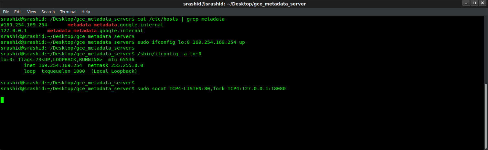
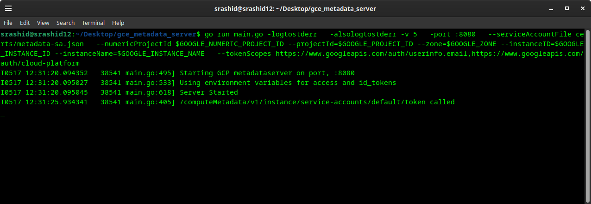

# GCE Metadata Server Emulator


## Background
This script acts as a GCE's internal metadata server for local testing/emulation.

It returns a live access_token that can be used directly by [Application Default Credentials](https://developers.google.com/identity/protocols/application-default-credentials) transparently.


For example, you can use `ComputeCredentials` on your laptop:

```python
#!/usr/bin/python

import google.auth.compute_engine
import google.auth.transport.requests

creds = google.auth.compute_engine.Credentials()
request = google.auth.transport.requests.Request()
creds.refresh(request)

session = google.auth.transport.requests.AuthorizedSession(creds)
r = session.get('https://www.googleapis.com/userinfo/v2/me').json()
print(str(r))
```

 This is useful to test any script or code locally that my need to contact GCE's metadata server for custom, user-defined variables or access_tokens.

 Another usecase for this is to verify how Application Defaults will behave while running a local docker container. A local running docker container will not have access to GCE's metadata server but by bridging your container to the emulator, you are basically allowing GCP API access directly from within a container on your local workstation (vs. running the code comprising the container directly on the workstation and relying on gcloud credentials (not metadata)).


>> This is not an officially supported Google product


For more information on the request-response characteristics:
* [GCE Metadata Server](https://cloud.google.com/compute/docs/storing-retrieving-metadata)

 The script performs the following:
 * returns the `access_token` provided by either
   * the serviceAccount JSON file you specify.
   * [workload identity federation](https://cloud.google.com/iam/docs/how-to#using-workload-identity-federation) configuration
   * service account impersonation
   * statically from a provided environment variable
 * returns Google issued OpendID token (`id_token`) for the Service Account using the audience you specify
 * return custom key-value attributes
 * Identity Token document

The endpoints that are exposed are:

 ```golang
r.Handle("/computeMetadata/v1/project/project-id")
r.Handle("/computeMetadata/v1/project/numeric-project-id")
r.Handle("/computeMetadata/v1/project/attributes/{key}")
r.Handle("/computeMetadata/v1/instance/service-accounts/")
r.Handle("/computeMetadata/v1/instance/service-accounts/{acct}/")
r.Handle("/computeMetadata/v1/instance/service-accounts/{acct}/{key}")
r.Handle("/computeMetadata/v1/instance/")
r.Handle("/")
 ```

You are free to expand on the endpoints surfaced here..pls feel free to file a PR!

Overall, the proxy works to emulate the link-local address `169.254.169.254` that is used by the metadata server.  Once a route to that is established (via `iptables` or `socat`), you can run a simple http webserver that responds back with the request details.

 - 


## Usage

This script runs a basic webserver and responds back as the Google Compute Engine's metadata server.  A local webserver
runs on a non-privileged port (default: 8080) and uses a `serviceAccountFile` file or environment variables return an `access_token`
and optional live project user-defined metadata.

You can run the emulator either:

1.  directly on your laptop
2.  within a docker container running locally.

### Running the metadata server directly

The following steps details how you can run the emulator on your laptop.

* **1. Reconfigure the /etc/hosts to resolve the metadata server**
```
# /etc/hosts
127.0.0.1       metadata metadata.google.internal
```

* **2. Redirect and accept requests to the metadata server**

GCE's metadata server's IP address on GCE is a special link-local address: `169.254.169.254`.  Certain application default credential libraries for google cloud references the metadata server by IP address so we're adding this in. An IP tables rule can redirect these requests to localhost:

```
iptables -t nat -A OUTPUT -p tcp -d 169.254.169.254 --dport 80 -j DNAT --to-destination 127.0.0.1:8080
```

Or, an alternative is to creates an IP address alias for the local system and then relay the traffic to the desired port.

To create an IP alias:

```bash
sudo ifconfig lo:0 169.254.169.254 up
```
You can veirify the alias was created by checking _ifconfig_
```
/sbin/ifconfig -a
lo:0      Link encap:Local Loopback
          inet addr:169.254.169.254  Mask:255.255.0.0
          UP LOOPBACK RUNNING  MTU:65536  Metric:1
```
(on windows)
```
netsh interface ipv4 add address "Loopback Pseudo-Interface 1" 169.254.169.254 255.255.0.0
```

To perform the relay of traffic to port 80 You need to install a utility to map port :80 traffic since REST calls to the metadata server are HTTP.  The following usees `socat`:
```
sudo apt-get install socat

sudo socat TCP4-LISTEN:80,fork TCP4:127.0.0.1:8080
```

If you don't mind running the program on port `:80` directly, you can skip the socat and iptables and simply start the emulator on the default http port.

- 


* **3. Download JSON ServiceAccount file or use impersonation**

Create a GCP Service Account JSON file

```bash
export GOOGLE_PROJECT_ID=`gcloud config get-value core/project`
export GOOGLE_NUMERIC_PROJECT_ID=`gcloud projects describe $GOOGLE_PROJECT_ID --format="value(projectNumber)"`
gcloud iam service-accounts create metadata-sa
```

You can either create a key that represents this service account and download it locally
```
gcloud iam service-accounts keys create metdata-sa.json --iam-account=metadata-sa@$GOOGLE_PROJECT_ID.iam.gserviceaccount.com
```

or preferably assign your user impersonation capabilities on it:

```bash
gcloud iam service-accounts \
  add-iam-policy-binding metadata-sa@$GOOGLE_PROJECT_ID.iam.gserviceaccount.com --member=user:`gcloud config get-value core/account` \
  --role=roles/iam.serviceAccountTokenCreator
```

You can assign IAM permissions now to the service account for whatever resources it may need to access

* **4. Run the metadata server**

Using Certs

```bash
mkdir certs/
mv metadata-sa.json certs

go run main.go -logtostderr \
  -alsologtostderr -v 5 \
  -port :8080 \
  --serviceAccountFile certs/metadata-sa.json \
  --numericProjectId $PROJECT_NUMBER \
  --tokenScopes https://www.googleapis.com/auth/userinfo.email,https://www.googleapis.com/auth/cloud-platform
```

or via impersonation

```bash
 go run main.go -logtostderr    -alsologtostderr -v 5   \
  -port :8080   \
  --impersonate \
  --serviceAccountEmail metadata-sa@$GOOGLE_PROJECT_ID.iam.gserviceaccount.com \
  --projectId=$GOOGLE_PROJECT_ID \
  --numericProjectId $GOOGLE_NUMERIC_PROJECT_ID \
  --tokenScopes https://www.googleapis.com/auth/userinfo.email,https://www.googleapis.com/auth/cloud-platform
```

or via [workload identity federation](https://cloud.google.com/iam/docs/how-to#using-workload-identity-federation)

```bash
export GOOGLE_APPLICATION_CREDENTIALS=`pwd`/sts-creds.json
go run main.go -logtostderr \
  -alsologtostderr -v 5 \
  -port :8080 \
  --federate \
  --serviceAccountEmail metadata-sa@$GOOGLE_PROJECT_ID.iam.gserviceaccount.com  \
  --projectId=$GOOGLE_PROJECT_ID \
  --numericProjectId $PROJECT_NUMBER \
  --tokenScopes https://www.googleapis.com/auth/userinfo.email,https://www.googleapis.com/auth/cloud-platform
```

To use this mode, you must first setup the Federation and then set the environment variable pointing to the [ADC file](https://cloud.google.com/iam/docs/configuring-workload-identity-federation#aws).

for reference, see

* [Exchange Generic OIDC Credentials for GCP Credentials using GCP STS Service](https://github.com/salrashid123/gcpcompat-oidc)
* [Exchange AWS Credentials for GCP Credentials using GCP STS Service](https://github.com/salrashid123/gcpcompat-aws)

where the `sts-creds.json` file is the generated one you created.  For example using the OIDC tutorial above, it may look like

for example, if the workload federation user is mapped to

```
principal://iam.googleapis.com/projects/1071284184436/locations/global/workloadIdentityPools/oidc-pool-1/subject/alice@domain.com
```

then that identity should have the binding to use the metadata service account:

```bash
# enable federation for principal://
gcloud iam service-accounts add-iam-policy-binding metadata-sa@$PROJECT_ID.iam.gserviceaccount.com \
    --role roles/iam.workloadIdentityUser \
    --member "principal://iam.googleapis.com/projects/$PROJECT_NUMBER/locations/global/workloadIdentityPools/oidc-pool-1/subject/alice@domain.com"
```

ultimately, the `sts-creds.json` will look like (note:, the `service_account_impersonation_url` value is not present)

```json
{
  "type": "external_account",
  "audience": "//iam.googleapis.com/projects/1071284184436/locations/global/workloadIdentityPools/oidc-pool-1/providers/oidc-provider-1",
  "subject_token_type": "urn:ietf:params:oauth:token-type:jwt",
  "token_url": "https://sts.googleapis.com/v1/token",
  "credential_source": {
    "file": "/tmp/oidccred.txt"
  }
}
```

where `/tmp/oidcred.txt` contains the original oidc token

or via docker


```bash


docker run \
  -v `pwd`/certs/:/certs/ \
  -p 8080:8080 \
  -t salrashid123/gcemetadataserver \
  -serviceAccountFile /certs/metdata-sa.json \
  -logtostderr -alsologtostderr -v 5 \
  -port :8080 \
  -numericProjectId $PROJECT_NUMBER \
  -tokenScopes https://www.googleapis.com/auth/userinfo.email,https://www.googleapis.com/auth/cloud-platform
```


Statup

- 


* **5. Test access to the metadata server**
In a new window, run

```bash
curl -v -H 'Metadata-Flavor: Google' http://metadata.google.internal/computeMetadata/v1/instance/service-accounts/default/token

>
< HTTP/1.1 200 OK
< Content-Type: application/json
< Metadata-Flavor: Google
< Server: Metadata Server for VM
< X-Frame-Options: 0
< X-Xss-Protection: 0
< Date: Mon, 26 Aug 2019 21:50:09 GMT
< Content-Length: 190
<
{"access_token":"ya29.c.EltxByD8vfv2ACageADlorFHWd2ZUIgGdU-redacted","expires_in":3600,"token_type":"Bearer"}
```

```bash
curl -v -H 'Metadata-Flavor: Google' http://169.254.169.254/computeMetadata/v1/instance/service-accounts/default/token

< HTTP/1.1 200 OK
< Content-Type: application/json
< Metadata-Flavor: Google
< Server: Metadata Server for VM
< X-Frame-Options: 0
< X-Xss-Protection: 0
< Date: Mon, 26 Aug 2019 21:51:28 GMT
< Content-Length: 190
<
{"access_token":"ya29.c.EltxByD8vfv2ACageADlorFHWd2ZUIgGdU-redacted","expires_in":3521,"token_type":"Bearer"}
```

- 


You can also use the python snippet using `Application Default Credentials` to test.

The following endpoints shows how to acquire an IDToken

```bash
curl -H "Metadata-Flavor: Google" \
'http://metadata/computeMetadata/v1/instance/service-accounts/default/identity?audience=https://foo.bar'
```

The `id_token` will be signed by google but issued by the service account you used
```json
{
  "alg": "RS256",
  "kid": "178ab1dc5913d929d37c23dcaa961872f8d70b68",
  "typ": "JWT"
}.
{
  "aud": "https://foo.bar",
  "azp": "metadata-sa@$PROJECT.iam.gserviceaccount.com",
  "email": "metadata-sa@PROJECT.iam.gserviceaccount.com",
  "email_verified": true,
  "exp": 1603550806,
  "iat": 1603547206,
  "iss": "https://accounts.google.com",
  "sub": "117605711420724299222"
}

```


>>> Unlike the _real_ gce metadataserver, this will **NOT** return the full identity document or license info :(`&format=[FORMAT]&licenses=[LICENSES]`)

### Run the metadata server with containers

#### Access the local emulator _from_ containers
If you run an app inside a docker container that needs to access the metadata server, there are two options:

1. use bridge networking
2. use host networking
3. create a custom network and run the metadata server in a container ((preferred).

##### Add bridge networking to the running Container (--net=bridge)
To use bridge networking, you need to first

1. create the interface alias for 169.254.169.254 --> lo:0
2. make sure ip_forward is enabled  _sudo sysctl -w net.ipv4.ip\_forward=1_
3. run socat to forward 80-->18080
4. start the container and pass in the host files pointing to the local emulator's ip address:

```
docker run -t --net=bridge --add-host metadata.google.internal:169.254.169.254 --add-host metadata:169.254.169.254 _your-image_
```
You may need to drop existing firewall rules and then restart the docker daemon to prevent conflicts or overrides.

##### Add host networking to the running Container (--net=host)

This will allow the container to 'see' the local interface on the laptop.  The disadvantage is the host's interface is the containers as well
```
docker run --net=host -t _your-image_
```

> *NOTE:*   using --net=host is only recommended for testing; For more information see:

* [Docker Networking](https://docs.docker.com/v1.8/articles/networking/#container-networking)
* [Embedded DNS server in user-defined networks](https://docs.docker.com/engine/userguide/networking/configure-dns/#/embedded-dns-server-in-user-defined-networks)

#### Running as Kubernetes Service

You can run the emulator as a kubernetes service but you cannot bind the link local address `169.254.169.254` with a k8s service. see [Kubernetes Services](https://kubernetes.io/docs/concepts/services-networking/service/#services-without-selectors):

_"The endpoint IPs must not be: loopback (127.0.0.0/8 for IPv4, ::1/128 for IPv6), or link-local (169.254.0.0/16 and 224.0.0.0/24 for IPv4, fe80::/64 for IPv6)."_

While you can connect via k8s service name, certain google cloud libraries look for the metadata server by IP address or allow overrides (eg, [google-auth-python](https://github.com/googleapis/google-auth-library-python/blob/master/google/auth/compute_engine/_metadata.py#L40))

https://kubernetes.io/docs/concepts/services-networking/service/#services-without-selectors

### Using static environment variables

If you do not have access to certificate file or would like to specify **static** token values via env-var, the metadata server supports the following environment variables as substitutions.  Once you set these environment variables, the service will not look for anything using the service Account JSON file (even if specified)

```bash
export GOOGLE_PROJECT_ID=`gcloud config get-value core/project`
export GOOGLE_NUMERIC_PROJECT_ID=`gcloud projects describe $GOOGLE_PROJECT_ID --format="value(projectNumber)"`

gcloud auth activate-service-account --key-file=`pwd`/certs/metdata-sa.json
export GOOGLE_ACCESS_TOKEN=`gcloud auth print-access-token`
export GOOGLE_ACCOUNT_EMAIL=`gcloud config get-value core/account`
export GOOGLE_ID_TOKEN=`gcloud auth print-identity-token --include-email --audiences=https://foo.bar`
```

for example,

```bash
go run main.go -logtostderr  \
   -alsologtostderr -v 5 \
   -port :8080  \
   --tokenScopes https://www.googleapis.com/auth/userinfo.email,https://www.googleapis.com/auth/cloud-platform
```

or
```
docker run \
  -p 8080:8080 \
  -e GOOGLE_ACCESS_TOKEN=$GOOGLE_ACCESS_TOKEN \
  -e GOOGLE_NUMERIC_PROJECT_ID=$GOOGLE_NUMERIC_PROJECT_ID \
  -e GOOGLE_PROJECT_ID=$GOOGLE_PROJECT_ID \
  -e GOOGLE_ACCOUNT_EMAIL=$GOOGLE_ACCOUNT_EMAIL \
  -e GOOGLE_ID_TOKEN=$GOOGLE_ID_TOKEN \  
  -t salrashid123/gcemetadataserver \
  -port :8080 \
  -tokenScopes https://www.googleapis.com/auth/userinfo.email,https://www.googleapis.com/auth/cloud-platform \
  -logtostderr -alsologtostderr -v 5

```

```
curl -v -H 'Metadata-Flavor: Google' http://metadata.google.internal/computeMetadata/v1/instance/service-accounts/default/token

some_static_token
```

### Allowing all firewall policies

The following set of command resets all firewall policies to allow all.  This is sometimes needed to allow clean socat or iptables.  Only do this if you know iptable rules are blocking traffic..

```bash
#!/bin/sh
echo "Stopping firewall and allowing everyone..."
iptables -F
iptables -X
iptables -t nat -F
iptables -t nat -X
iptables -t mangle -F
iptables -t mangle -X
iptables -P INPUT ACCEPT
iptables -P FORWARD ACCEPT
iptables -P OUTPUT ACCEPT
```

### Port mapping :80 --> :8080
Since GCE's metadata server listens on http for :80, this script relies on utilities like 'socat' to redirect port traffic.  _socat_ has pretty
basic connection handling so you'd be better with iptables, gunicorn.
You are free to either run the script on port :80 directly (as root), or use a utility like iptables, HAProxy, nginx, etc to do this mapping.

The following example of an iptables route 80 -> 8080 on the local interface
```
sudo iptables -t nat -A OUTPUT -o lo -p tcp --dport 80 -j REDIRECT --to-port 8080
```

#### Extending the sample
You can extend this sample for any arbitrary metadata you are interested in emulating (eg, disks, hostname, etc).
Simply add the routes to the webserver and handle the responses accordingly.  It is recommended to view the request-response format directly on the metadata server to compare against.


### TODO

1.  Directory Browsing

Instead of explicitly setting routes, use the local filesystem to return the structure for non-dynamic content or attributes.  In this way, the metadata server just returns the directory and files that mimics the metadata server structure.

eg: create a directory structure similar to:

```
./static/
    0.1/
    computeMetadata/
      v1beta1/
      v1/
        instance/
        oslogin/
        project/
```


```golang
r.Handle("/", checkMetadataHeaders(http.FileServer(http.Dir("./static"))))
```
Which currently returns HTML content as well as`Content-Type: text/html; charset=utf-8`, the metadata server new-line text  as `Content-Type: application/text`

TODO: figure out how to return text payload similar to the metadata server

```
$ curl -H "Metadata-Flavor: Google" -v http://metadata.google.internal/
*   Trying 169.254.169.254...
* TCP_NODELAY set
* Connected to metadata.google.internal (169.254.169.254) port 80 (#0)
> GET / HTTP/1.1
> Host: metadata.google.internal
> User-Agent: curl/7.52.1
> Accept: */*
> Metadata-Flavor: Google
>
< HTTP/1.1 200 OK
< Metadata-Flavor: Google
< Content-Type: application/text
< Date: Mon, 26 Aug 2019 17:08:17 GMT
< Server: Metadata Server for VM
< Content-Length: 22
< X-XSS-Protection: 0
< X-Frame-Options: SAMEORIGIN
<
0.1/
computeMetadata/
```

```
$ curl -H "Metadata-Flavor: Google" -s http://metadata.google.internal/computeMetadata/v1/instance
/computeMetadata/v1/instance/

$ curl -H "Metadata-Flavor: Google" -s http://metadata.google.internal/computeMetadata/v1/instance/
attributes/
cpu-platform
description
disks/
guest-attributes/
hostname
id
image
licenses/
machine-type
maintenance-event
name
network-interfaces/
preempted
remaining-cpu-time
scheduling/
service-accounts/
tags
virtual-clock/
zone
```
